# Universal Assistant built with LangGraph and Model Context Protocol (MCP)


[Model Context Protocol (MCP)](https://modelcontextprotocol.io/introduction) is an open protocol that enables seamless integration between LLM applications and external data sources and tools. Whether you're building an AI-powered IDE, enhancing a chat interface, or creating custom AI workflows, MCP provides a standardized way to connect LLMs with the context they need. Think of MCP like a USB-C port for AI applications. Just as USB-C provides a standardized way to connect your devices to various peripherals and accessories, MCP provides a standardized way to connect AI models to different data sources and tools.

[LangGraph](https://langchain-ai.github.io/langgraph/) is a framework designed to enable seamless integration of language models into complex workflows and applications. It emphasizes modularity and flexibility. Workflows are represented as graphs. Nodes correspond to actions, tools, or model queries. Edges define the flow of information between them. LangGraph provides a structured yet dynamic way to execute tasks, making it ideal for writing AI applications involving natural language understanding, automation, and decision-making.

In [this earlier article](https://medium.com/@pranavdhoolia/building-and-deploying-a-virtual-assistant-with-langgraph-5c68dabd82db) we enhanced LangGraph's retrieval agent template to develop and deploy an AI solution.

In this project, we combine LangGraph with MCP to build our own Universal Assistant. For our universal assistant we implement a multi-agent pattern as follows:


Assistant receives the user message and decides the agent to use. The agent node decides the right tool to use, and calls the tool on the MCP server. Since all our agents are based on MCP, a single MCP-Agent node is sufficient for LLM based orchestraion, and another single node is sufficient to work with MCP servers to invoke their tools.


## Development Setup

1.  Create and activate a virtual environment
    ```bash
    git clone https://github.com/esxr/langgraph-mcp.git
    cd langgraph-mcp
    python3 -m venv .venv
    source .venv/bin/activate
    ```

2.  Install Langgraph CLI
    ```bash
    pip install -U "langgraph-cli[inmem]"
    ```
    Note: "inmem" extra(s) are needed to run LangGraph API server in development mode (without requiring Docker installation)

3.  Install the dependencies
    ```bash
    pip install -e .
    ```

4.  Configure environment variables
    ```bash
    cp env.example .env
    ```

    Add your `OPENAI_API_KEY`, `GITHUB_PERSONAL_ACCESS_TOKEN` etc. to the `.env`

    **Note**: We have added support for *Milvus Lite Retriever* (support file based URI). Milvus Lite won't work on Windows. For Windows you may need to use Milvus Server (Easy to start using Docker), and change the `MILVUS_DB` config to the server based URI. You may also enhance the [retriever.py](src/langgraph_mcp/retriever.py) to add retrievers for your choice of vector databases!


## Implementation Details

There are 3 main parts to our implementation:
1. Building the Router
2. The Assistant
3. A generic MCP wrapper

### Building the Router

Our graph to build the router is implemented in [`build_router_graph.py`](src/langgraph_mcp/build_router_graph.py). It collects routing information based on tools, prompts, and resources offered by each MCP server using our [`mcp_wrapper.py`](src/langgraph_mcp/mcp_wrapper.py). It indexes this routing information for each server in a vector database.

```mermaid
sequenceDiagram
  participant G as Build-Router<br/>Graph
  participant MW as MCP Wrapper
  participant MS as MCP Servers
  participant V as Vector Index

  loop for all mcp-servers in config
  G ->> MW: Get Routing Information (server-config)
  MW ->> MS: list_tools
  MS --) MW: tools
  MW ->> MS: list_resources
  MS --) MW: resources
  MW ->> MS: list_prompts
  MS --) MW: prompts
  MW --) G: routing_information 𝒇(tools, resources, prompts)
  end
  G ->> V: Build Vector Index (list(Document(page_content=routing_information, metadata{id: mcp_server_name})))
```

<!--

-->


### The Assistant

The assistant graph is implemented in [`assistant_graph.py`](src/langgraph_mcp/assistant_graph.py). The following animation describes the role of various nodes and the flow of control thru it, with the help of an example


### A Generic MCP Wrapper

[`mcp_wrapper.py`](src/langgraph_mcp/mcp_wrapper.py) employs a Strategy Pattern using an abstract base class (`MCPSessionFunction`) to define a common interface for executing various operations on MCP servers. The pattern includes:
1.  Abstract Interface:
    - `MCPSessionFunction` defines an async `__call__` method as a contract for all session functions.
2.  Concrete Implementations:
    - `RoutingDescription` class implements fetching routing information based on tools, prompts, and resources.
    - `GetTools` class implements fetching tools for the MCP server and transforming them to the format consumable by LangGraph.
    - `RunTool` class implements invoking a tool on MCP server and returning its output.
3.  Processor Function:
    - `apply` serves as a unified executor. It:
    - Initializes a session using `stdio_client` from `mcp` library.
    - Delegates the actual operation to the provided `MCPSessionFunction` instance via `await fn(server_name, session)`.
4.  Extensibility:
    - New operations can be added by subclassing `MCPSessionFunction` without modifying the cor    e processor logic. for e.g. we should be able to add support for getting tools and executing tools using this pattern.

## A Demonstration!

Here's an end to end video!

https://github.com/user-attachments/assets/cf5b9932-33a0-4627-98ca-022979bfb2e7
